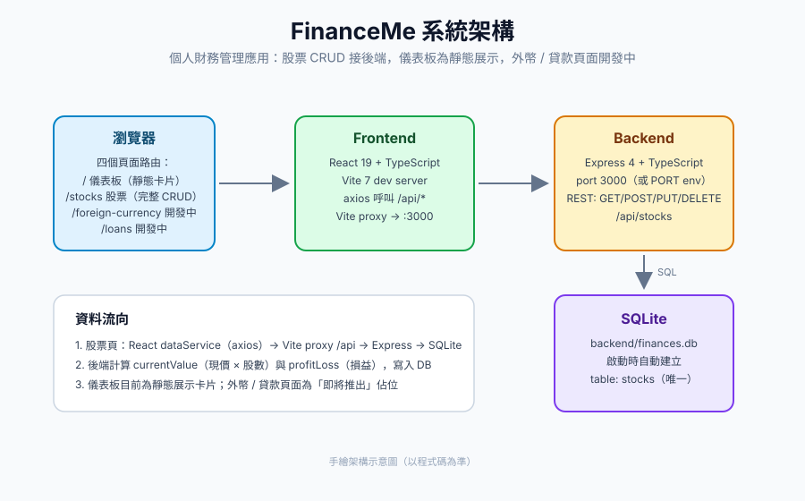

# FinanceMe

個人財務管理 Web 應用：用 React 前端追蹤股票投資損益，Express + SQLite 後端存取資料，儀表板提供資產總覽（手機版介面）。



## 功能

- **股票投資**（`/stocks`）：完整 CRUD。新增股票（代號、名稱、現價、購買成本、股數），後端自動計算市值（現價 × 股數）與損益，並可刪除持股。資料寫入後端 SQLite，重新整理不會遺失。
- **儀表板**（`/`）：資產總覽卡片與配置比例（目前為靜態展示資料）。
- **外幣 / 定存**（`/foreign-currency`）：頁面已建好，功能開發中（顯示「即將推出」）。
- **貸款管理**（`/loans`）：頁面已建好，功能開發中（顯示「即將推出」）。

## 技術棧

| 層 | 技術 |
|---|---|
| 前端 | React 19 + TypeScript、Vite 7、react-router-dom 7、axios |
| 後端 | Node.js + Express 4 + TypeScript、SQLite（sqlite3） |
| 開發工具 | nodemon + ts-node（後端熱重載）、ESLint |

## 目錄結構

```
FinanceMe/
├── backend/               # Express + SQLite 後端
│   ├── src/
│   │   ├── index.ts       # 伺服器入口、/api/stocks 路由
│   │   └── db.ts          # SQLite 初始化（自動建立 finances.db）
│   └── package.json
├── frontend/              # React 前端（Vite）
│   ├── src/
│   │   ├── App.tsx        # 路由：/、/stocks、/foreign-currency、/loans
│   │   ├── pages/         # DashboardPage、StockPage、ForeignCurrencyPage、LoanPage
│   │   ├── components/    # Dashboard、Stocks、ForeignCurrency、Loans、Navbar
│   │   └── services/dataService.ts  # 經 Vite proxy 呼叫 /api/*
│   └── package.json
└── docs/images/           # 文件配圖
```

## 安裝與啟動

需先安裝 [Node.js](https://nodejs.org/)（建議 20+）。

**1. 啟動後端**（預設 port 3000）：

```bash
cd backend
npm install
npm run dev        # nodemon + ts-node 熱重載
```

後端啟動時會在 `backend/` 目錄自動建立 `finances.db`（SQLite）並建好 `stocks` 資料表。

**2. 啟動前端**（另開一個終端機）：

```bash
cd frontend
npm install
npm run dev        # Vite dev server，預設 http://localhost:5173
```

前端的 `/api/*` 請求會經 Vite proxy 轉發到 `http://localhost:3000`，所以兩個都要跑起來股票功能才會正常。

其他指令：

| 指令 | 位置 | 用途 |
|---|---|---|
| `npm run build` | backend | `tsc` 編譯到 `dist/` |
| `npm start` | backend | `node dist/index.js`（正式啟動，需先 build） |
| `npm run build` | frontend | `tsc -b && vite build` 產出靜態檔 |
| `npm run preview` | frontend | 預覽 build 成果 |

## API 一覽

| 方法 | 路徑 | 說明 |
|---|---|---|
| `GET` | `/api/stocks` | 列出所有股票 |
| `POST` | `/api/stocks` | 新增股票（`symbol`、`name`、`currentPrice`、`purchasePrice`、`shares` 必填） |
| `PUT` | `/api/stocks/:id` | 更新股票 |
| `DELETE` | `/api/stocks/:id` | 刪除股票 |

`POST` / `PUT` 會由後端計算 `currentValue`（現價 × 股數）與 `profitLoss`（損益）。

## 注意事項

- 後端程式碼（`db.ts`、`index.ts`）使用了 `sqlite` 套件，但 `backend/package.json` 的 dependencies 只有 `sqlite3`。若 `npm install` 後啟動報錯找不到 `sqlite` 模組，請再執行 `npm install sqlite`。
- `finances.db` 是本地 SQLite 檔案，未被加入版本控制忽略規則——若不想把本機資料推上 Git，請自行加到 `.gitignore`。
- 儀表板的總覽數字目前是靜態展示；外幣與貸款頁面為佔位頁，功能尚未接後端。

## License

repo 內沒有 LICENSE 檔案；`backend/package.json` 宣告為 ISC。
